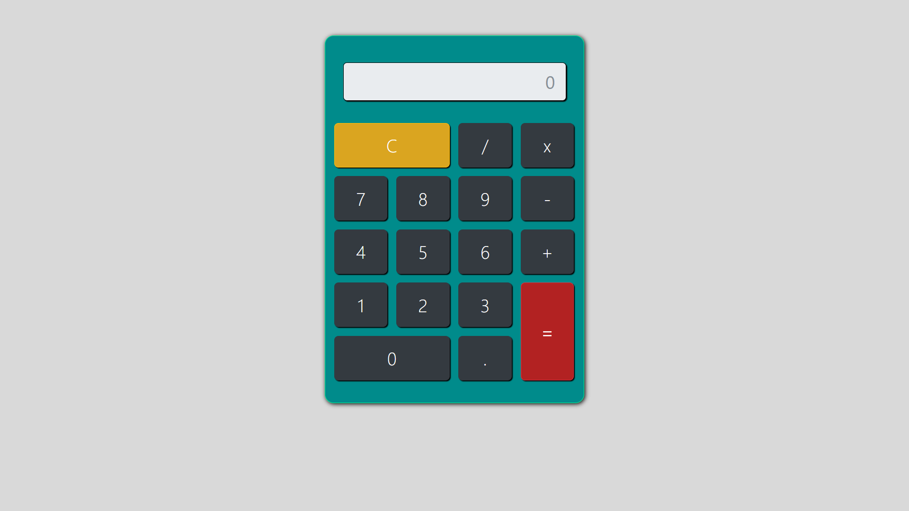

🧮 Calculadora

Projeto criado durante meus estudos no curso de Desenvolvimento Web Moderno.  
Esta é uma calculadora funcional feita com HTML, CSS, JavaScript e Bootstrap.

📌 Funcionalidades

- Operações básicas: adição, subtração, multiplicação e divisão
- Botão de limpar (C)
- Ponto decimal
- Interface visual personalizada com Bootstrap 4

💡 Aprendizados

- Manipulação do DOM com JavaScript
- Funções e estruturas condicionais
- Estilização com Bootstrap e CSS puro
- Organização de layout e semântica

📷 Imagem do projeto

👨‍💻 Autor

**Natã Lucas Ferreira Santos**  
[GitHub](https://github.com/Natanx07)
